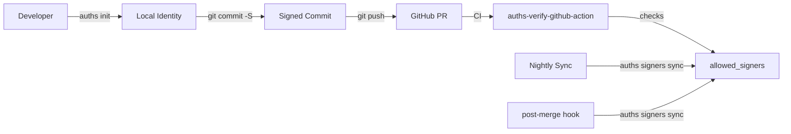

# Monorepo Signing with Auths

This example demonstrates how to set up [Auths](https://github.com/auths-dev/auths) for a multi-developer monorepo with CI verification, git hooks, and team onboarding workflows.

## Quick Start

```bash
# 1. Clone and set up your developer identity
git clone https://github.com/auths-dev/example-monorepo-signing.git
cd example-monorepo-signing
./scripts/setup-developer.sh

# 2. Make a signed commit
echo "hello" >> src/main.rs
git commit -am "test: my first signed commit"

# 3. Verify it
git log --show-signature -1
```

## What's Included

| Path | Purpose |
|------|---------|
| `.github/workflows/verify-commits.yml` | CI verification of PR commits using `auths-verify-github-action` |
| `.github/workflows/sync-allowed-signers.yml` | Nightly sync of `allowed_signers` from the registry |
| `.auths/allowed_signers` | Team's authorized signing keys (checked into the repo) |
| `.githooks/pre-commit` | Warns if a commit would be unsigned |
| `.githooks/post-merge` | Auto-syncs `allowed_signers` after pulling |
| `docs/onboarding.md` | Step-by-step guide for new team members |
| `docs/offboarding.md` | Key revocation procedure |
| `docs/rotation.md` | 90-day key rotation policy |
| `scripts/setup-developer.sh` | One-command developer setup |
| `scripts/add-team-members-from-github.sh` | Bulk-add signers from a GitHub org |

## Architecture



## Prerequisites

- Git 2.34+
- [Auths CLI](https://github.com/auths-dev/auths) (`brew install auths-dev/auths-cli/auths`)

## How It Works

1. **Developer setup**: Each developer runs `auths init` to create a cryptographic identity and `auths git setup` to configure Git for SSH signing.

2. **Signing commits**: With `commit.gpgsign = true`, Git automatically signs every commit using the developer's Auths-managed SSH key.

3. **Verifying in CI**: The `verify-commits.yml` workflow uses `auths-verify-github-action` to check that all PR commits are signed by keys listed in `.auths/allowed_signers`.

4. **Keeping keys in sync**: The `sync-allowed-signers.yml` workflow runs nightly to pull the latest keys from the Auths registry. The `post-merge` git hook does the same after every `git pull`.

5. **Team management**: New developers are onboarded via `docs/onboarding.md`. When someone leaves, follow `docs/offboarding.md` to revoke their key.

## Troubleshooting

**"error: commit not signed"** — Run `auths git setup` to configure Git signing, then `git commit --amend -S` to re-sign.

**"unknown key" in CI** — The signer's key isn't in `.auths/allowed_signers`. Run `auths signers add-from-github <username>` and commit the updated file.

**Pre-commit hook warning** — The hook warns but doesn't block. Run `auths git setup` to enable signing.
